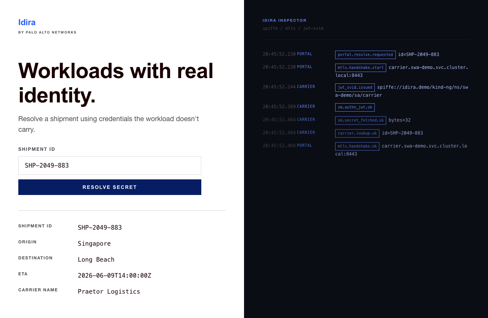
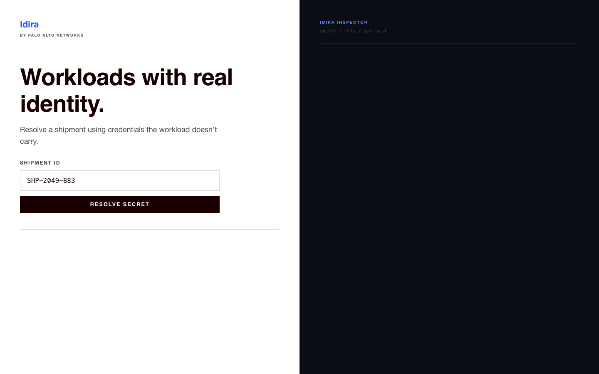

# Idira SWA Demo

A Mac-laptop demo of **Palo Alto Networks' Idira Secure Workload Access (SWA)**: a real workload fetches a real secret from CyberArk Secrets Manager – SaaS without ever holding a static credential. The UI splits left/right so you can *watch* the identity exchange happen on every click.



---

## New to workload identity? Start here.

If terms like **SPIFFE**, **SVID**, **mTLS**, or **JWT authn** aren't second-nature yet, you'll get a lot more out of this demo after a quick visual tour:

> **→ [thesecretlivesofidentity.com](https://thesecretlivesofidentity.com).** Interactive visualizations that demystify workload identity. Start with the SPIFFE explainer; it covers exactly the concepts this demo puts into motion.

The 60-second version, just to keep reading:

- **The problem.** Workloads (services, jobs, agents) need secrets like API keys, DB passwords, OAuth tokens. The traditional fix is to bake those secrets into environment variables, config files, or container images. That's a leak waiting to happen, and rotating the secret means redeploying everything that has a copy.
- **The SPIFFE answer.** Give every workload a short-lived **cryptographic identity** instead. It's issued by a local agent on the node, scoped to that workload only, with no shared secret. The identity itself becomes proof of who the workload is. A secrets manager can then say "ok, *this* identity is allowed to read *this* secret" and hand it over on demand.
- **Two flavors of identity.** SPIFFE issues two kinds of credentials, called **SVIDs** (SPIFFE Verifiable IDs):
  - **X.509-SVID** is a short-lived TLS certificate. Used for **mTLS** (mutual TLS) between services: both sides present a SVID and verify the other's SPIFFE ID before any application data flows.
  - **JWT-SVID** is a short-lived signed JWT. Used to authenticate to systems that speak HTTP/REST (like Secrets Manager), where you can't do TLS mutual auth but you *can* present a signed token.
- **Where Idira fits.** Idira SWA is Palo Alto Networks' commercial SPIFFE implementation: a control plane on the CyberArk Secrets Manager – SaaS tenant, plus an in-cluster server + agent that issue SVIDs to your workloads. This demo runs the whole stack end-to-end on a single kind cluster.

That's all you need. If you want to go deeper into what attestation actually is, how trust domains work, or why JWT-SVID audience claims matter, the visualizations at [thesecretlivesofidentity.com](https://thesecretlivesofidentity.com) are the fastest way in.

---

## What the demo actually does

Open `http://localhost:8080` after `make up && make portforward`:



- **Left pane.** *Praetor Logistics* shipment-lookup portal. A plausible-looking internal app that looks up a shipment by ID. Type a shipment ID (e.g. `SHP-2049-883`), click **RESOLVE SECRET**.
- **Right pane.** *Idira inspector.* A live trace of every identity hop the request triggers. Each event is a real thing happening: the portal opening an mTLS connection to the carrier, the carrier asking the local agent for a JWT-SVID, the carrier exchanging that JWT at Secrets Manager for an access token, the secret being fetched, the shipment being looked up.

End-to-end click → result → fully-populated inspector takes ~200 ms. Nothing is mocked except the carrier's downstream "did you find the shipment" call, which returns canned JSON from a fixture file.

### The flow, step by step

1. **Browser → portal.** Plain HTTP, localhost.
2. **Portal → carrier (mTLS).** Both services already have X.509-SVIDs from the local SWA agent. They open a mutually-authenticated TLS connection where each side verifies the other's exact SPIFFE ID (e.g. `spiffe://idira.demo/kind-ng/ns/swa-demo/sa/carrier`).
3. **Carrier → agent (Workload API).** Carrier asks the local SWA agent (over a unix socket) for a fresh JWT-SVID with audience `conjur`.
4. **Carrier → Secrets Manager (HTTPS POST).** Carrier sends the JWT-SVID to SM's `authn-jwt` endpoint. SM verifies the signature against SWA's per-trust-domain JWKS and returns a short-lived access token.
5. **Carrier → Secrets Manager (HTTPS GET).** Carrier uses that access token to fetch one specific variable (`swa-demo/carrier/api-key`).
6. **Carrier → fixture.** Uses the secret as a (mocked) carrier API key and looks up the shipment.
7. **Portal → browser.** Renders the shipment JSON.

What's *not* present anywhere: a hardcoded `API_KEY=…` env var, a mounted secret file, a long-lived bearer token, or any credential the operator typed in.

---

## Prerequisites

- macOS Apple Silicon (the bundled SWA container images are `arm64v8`-only for this demo).
- On PATH: `docker`, `kind`, `kubectl`, `helm`, `terraform`, `jq`, `curl`, `envsubst`, `summon`, `conceal`.
- A way to load `.envrc` into your shell. [`direnv`](https://direnv.net/) is recommended (`brew install direnv` plus `eval "$(direnv hook zsh)"` in your shell rc, then `direnv allow` in this directory). Without it you must `source .envrc` manually in every new shell before running `make` -- `make doctor` will fail loudly if the env isn't loaded.
- `node` ≥ 18 (for the headless Playwright smoke test).
- A `swa-release-1.0.4/` bundle in this directory (gitignored vendor drop from CyberArk, not in this repo).
- A CyberArk Secrets Manager – SaaS tenant with a Service User you can authenticate as. Copy `.envrc.example` to `.envrc` and set `PANW_SM_TENANT` (your SM SaaS subdomain) and `CONCEAL_NAMESPACE` (the Keychain path where you've stored the Service User credentials).

**No secrets in `.envrc`.** Service User credentials live in the macOS Keychain via [Conceal](https://github.com/infamousjoeg/conceal), under `${CONCEAL_NAMESPACE}/client_id` and `${CONCEAL_NAMESPACE}/client_secret`. Every tenant-touching command is wrapped in [`summon -p conceal_summon`](https://cyberark.github.io/summon), which injects them as env vars for that subprocess only. They're never on disk in cleartext and never visible to `ps`.

`make doctor` enforces all the above (tools, host, env vars, Conceal-stored credentials, tenant reachability) and exits non-zero with a concrete diagnostic if anything's missing.

---

## Quick start

```bash
cp .envrc.example .envrc
$EDITOR .envrc                                    # set PANW_SM_TENANT + CONCEAL_NAMESPACE
direnv allow                                       # or `source .envrc` -- $CONCEAL_NAMESPACE must be exported before the next two commands

# Store your Service User creds in the macOS Keychain (one-time):
conceal set "$CONCEAL_NAMESPACE/client_id"     <your-service-user-login>
conceal set "$CONCEAL_NAMESPACE/client_secret" <your-service-user-api-key>

make doctor                                        # verify prerequisites
make up                                            # full deploy + headless smoke (~4 min)
make portforward                                   # serve portal on http://localhost:8080
# ... click around, watch the inspector, demo away ...
make down                                          # tear everything down (cluster + tenant state)
```

The first `make up` takes ~4 minutes because it has to load the bundled SWA container images into the kind cluster, run `terraform apply` against your tenant, install two Helm charts, and build the two demo Go services. Subsequent cycles after `make down` take closer to 2 minutes.

---

## Build it incrementally

The whole demo lands in three milestones. You can run any of them in isolation:

| Target | What it does | Time |
|---|---|---|
| `make up-m1` | kind cluster + SWA platform (server + agent healthy, SPIFFE hierarchy registered on tenant) | ~1 min |
| `make up-m2` | + carrier Go service + JWT authn + scoped Conjur policy + secret on tenant | ~2 min |
| `make up`    | + portal Go service + mTLS + UI + headless Playwright smoke | ~4 min |

Each milestone has an acceptance check:

| Target | What it asserts |
|---|---|
| `make smoke-m1` | server/agent healthy, RSA workload key override applied (SM JWT authn rejects EC-signed JWTs) |
| `make smoke-m2` | carrier resolves a shipment end-to-end via JWT-SVID, error paths return structured 502s |
| `make smoke-m3` | full click sequence emits all 6 expected trace event types within 3 s, brand asserts pass |
| `make smoke`    | all three, in order |

---

## How tokens behave

Identity OAuth tokens are ≤15 min; SM access tokens are ~8 min. Every Make target that touches the tenant re-mints a fresh operator token via `scripts/get-sm-token.sh` (which itself is wrapped in `summon -p conceal_summon`). For ad-hoc `terraform` runs, `eval "$(make tf-token)"` exports a fresh set into your current shell.

`make down` is hardened against the "token expired mid-destroy" failure mode: it retries the `terraform destroy` up to 3 times with a fresh token per attempt, stopping as soon as `terraform state list` is empty.

---

## Architecture at a glance

Three layers:

1. **Control plane: CyberArk Secrets Manager – SaaS.** Holds the SPIFFE hierarchy (trust domain → server group → node group → server), signs SVIDs, holds the secret. Managed declaratively via two Terraform providers: [`cyberark/swa`](https://registry.terraform.io/providers/cyberark/swa/latest) (bundled, SPIFFE platform layer) and [`cyberark/conjur`](https://registry.terraform.io/providers/cyberark/conjur/latest) (public registry, Conjur policy / authenticator / secret).
2. **SWA Server (in-cluster Deployment).** Authenticates to the control plane via projected SA token. Listens on `:8443` (gRPC for agents) and `:8080` (web). Holds the cluster's PSAT trust anchor.
3. **SWA Agent (in-cluster DaemonSet).** Per-node. Mints SVIDs for workloads. Exposes a SPIFFE Workload API socket at `/tmp/swa-agent/public/api.sock` via `hostPath` so co-located workload pods can fetch SVIDs without RPCs leaving the node.

Demo apps in `apps/`:

- **`carrier`** (Go). The workload that actually consumes a secret. Single binary, distroless image, ~150 lines of business logic. Uses [`go-spiffe/v2`](https://github.com/spiffe/go-spiffe) for SVID handling.
- **`portal`** (Go + vanilla HTML/CSS/JS). The browser-facing surface. Opens mTLS to carrier, multiplexes its own trace events with the carrier's trace SSE into one stream for the inspector pane. Vanilla front end on purpose: no React, no Tailwind, no shadcn.

---

## Found a bug? Want to learn the concepts?

- **Bug or feature request for this demo:** open an issue on this repo.
- **Want to understand SPIFFE, SVIDs, attestation, trust domains, or workload identity in general?** **[thesecretlivesofidentity.com](https://thesecretlivesofidentity.com)** is the best starting point. Interactive visualizations that build intuition far faster than reading specs.
- **CyberArk Secure Workload Access product docs (GA):** [docs.cyberark.com/secrets-manager-saas/.../ccl-getstarted-swa-lp.htm](https://docs.cyberark.com/secrets-manager-saas/latest/en/content/conjurcloud/ccl-getstarted-swa-lp.htm).

---

## Security and license

**Secrets handling.** No secret material is committed to this repo, and `make doctor` enforces that posture (any `.envrc` containing CLIENT_ID/SECRET would be flagged). Service User credentials live in the macOS Keychain via [Conceal](https://github.com/cyberark/conceal); every tenant-touching command is wrapped in [`summon -p conceal_summon`](https://github.com/cyberark/summon), which injects them as env vars for that subprocess only. Never on disk in cleartext, never visible to `ps`. The SM operator token has an ~8 min TTL and is re-minted per Make target invocation rather than cached.

**In-cluster trust.** mTLS authorizers between the portal and carrier services use explicit [`tlsconfig.AuthorizeID(peerSPIFFE)`](https://pkg.go.dev/github.com/spiffe/go-spiffe/v2/spiffetls/tlsconfig#AuthorizeID), never `AuthorizeAny` or `AuthorizeMemberOf`. The Conjur policy scopes the carrier's SPIFFE ID to read+execute on exactly one variable (`swa-demo/carrier/api-key`), not a glob or pattern. The only cluster-wide RBAC permission granted is `TokenReview`, required by the `k8s_psat` node attestor.

**Vulnerability reporting.** This is a demo, not a production deployment. If you spot a security issue please open a GitHub issue (or contact the maintainer directly for anything you'd rather not file publicly).

**License.** [Apache 2.0](LICENSE). Third-party component attribution in [NOTICE](NOTICE).
