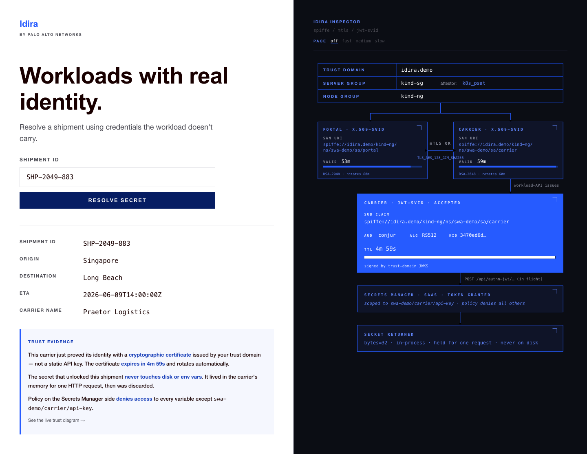

# Idira SWA Demo


> A Mac laptop demo of Idira Secure Workload Access: real workloads fetch real secrets via SPIFFE identity, with zero static credentials.



## Table of contents

- [What this is](#what-this-is)
- [Quick start](#quick-start)
- [Prerequisites](#prerequisites)
- [What you will see when it runs](#what-you-will-see-when-it-runs)
- [Architecture](#architecture)
- [Build incrementally](#build-incrementally)
- [Repository layout](#repository-layout)
- [Security](#security)
- [Contributing](#contributing)
- [Maintainers](#maintainers)
- [License](#license)

## What this is

A self-contained sandbox that runs the full Idira Secure Workload Access (SWA) stack on a single kind cluster on your Mac. Two Go demo apps (`carrier` and `portal`) authenticate to a real Idira Secrets Manager - SaaS tenant using short-lived SPIFFE-issued credentials and fetch a real secret. No API key is ever baked into an image, mounted from a file, or typed into a config. Time from `make up` to a running portal is about four minutes on a clean clone.

The point is to make the identity exchange visible. The portal UI is a split-pane Idira product surface: a Praetor Logistics shipment-lookup portal on the left (the consumer app, with voyage progress, manifest, and recent-activity feed) and a live Idira Inspector on the right (the identity machinery, visualized). Three swappable inspector views (Topology, Layers, Trace) all read the same engine state so you can pick the framing that lands best with the room. A Carrier toggle (Internal / External) flips between the success path and the M7 foreign-trust-domain rejection, which terminates at the wire layer in Go's standard `crypto/tls` verifier and surfaces the rejected cert's SPIFFE URI in an orange callout chip.

New to SPIFFE or workload identity? Start with [Concepts](https://github.com/infamousjoeg/idira-swa-demo/wiki/Concepts) on the Wiki, or work through the interactive visualizations at [thesecretlivesofidentity.com](https://thesecretlivesofidentity.com).

## Quick start

**First time on this laptop?** Run `make setup` once. It walks you through installing missing tools, building `.envrc`, and storing your Idira Service User credentials in the macOS Keychain. See [First-time setup](https://github.com/infamousjoeg/idira-swa-demo/wiki/First-time-setup) for the full walkthrough.

```bash
make setup                          # one-time guided onboarding
make doctor                         # verify prerequisites
make up                             # full deploy + smoke (~4 min)
make portforward PORT=18080         # serve the portal on http://localhost:18080
make down                           # tear everything back down
```

Open `http://localhost:18080` once `make portforward PORT=18080` is running, then click **Resolve secret** to watch the trust diagram walk. Present at 1920x1080 or larger; the layout was designed and visual-regression-tested at that demo viewport.

The first `make up` takes about four minutes: it loads SWA container images into the kind cluster, applies Terraform against your tenant, installs the two Helm charts, and builds the demo Go services. Subsequent cycles after `make down` finish in about two minutes.

When you are done, `make down` tears the cluster and the tenant Terraform state down together.


## Prerequisites

- macOS on Apple Silicon. The bundled SWA container images are `arm64v8`-only.
- Docker (or OrbStack), `kind`, `kubectl`, `helm`, `terraform`, `jq`, `summon`, `conceal`, `direnv`, and Node 18+ on PATH.
- Homebrew. `make setup` uses it to install anything missing above, with your consent at each step.
- A `swa-release-v1.0.0.tgz` vendor tarball from Idira in the repo root (gitignored; obtain separately). `make unpack` extracts it on demand into `.swa-release/`; override the filename via `SWA_RELEASE_TGZ` in `.envrc` if you have a different release.
- An Idira Secrets Manager - SaaS tenant and a Service User you can authenticate as.
- An `.envrc` with `PANW_SM_TENANT` and `CONCEAL_NAMESPACE` set (created by `make setup`).

Hand-installing instead of running `make setup`? See [Manual prereqs](https://github.com/infamousjoeg/idira-swa-demo/wiki/Manual-prereqs).

## What you will see when it runs

The left pane is a plausible internal shipment-lookup portal: type a shipment ID, pick a carrier (Internal or External), click **Resolve secret**, get back a shipment record with a voyage progress strip (Loaded -> In transit -> Arrived), manifest fields with container details, and a recent-activity feed. The right pane is the live Idira Inspector: the same SPIFFE trust machinery rendered three different ways. Pick the view that lands best with your room.

- **Topology** (default) is a vertical trust-path diagram with workload cards joined under an mTLS bracket, descending through JWT-SVID, Secrets Manager, and the returned secret.
- **Layers** is the brand "gates of defense" rendered structurally: five stacked horizontal layers (Node attestation, Mutual TLS, JWT-SVID, Access token, Secret) illuminating left-to-right as the request passes through them.
- **Trace** is the streaming identity log: a compact node strip across the top and timestamped SSE-style event rows below.

Switching views mid-resolve preserves engine state. A click resolves in well under 200 ms on the wire; the inspector paces itself for legibility (Off / Fast / Med / Slow segmented in the chrome, or `?pace=off` in the URL for fully real-time behavior). The TTL meter at the top of the inspector reads the real `exp` of the freshly minted JWT-SVID and counts down live. The carrier toggle on the left resets the engine so you can A/B the success and rejection paths cleanly.

Full screenshot walkthrough and wire-trace breakdown: [Portal tour](https://github.com/infamousjoeg/idira-swa-demo/wiki/Portal-tour) and [Wire trace](https://github.com/infamousjoeg/idira-swa-demo/wiki/Wire-trace).

- **Demonstrates trust-domain enforcement.** A second carrier in a foreign trust
  domain (`acme.courier`) is genuinely rejected at the mTLS layer -- no
  federation simulation, no toggle, just an honest `x509: certificate signed
  by unknown authority` from Go's standard verifier. See [Beat 2](docs/under-the-hood.md#beat-2--what-happens-at-a-trust-boundary).

## Architecture

Three layers cooperate to issue and validate identity. An Idira Secrets Manager - SaaS tenant is the control plane: it holds the SPIFFE trust hierarchy, signs SVIDs, and stores the demo secret. An in-cluster SWA Server authenticates to the control plane and serves agents over gRPC. A SWA Agent DaemonSet runs on every node, mints SVIDs for local workloads, and exposes them through a unix-socket Workload API. The demo apps (`carrier` and `portal`) consume those SVIDs to do mTLS and to mint JWT-SVIDs for the Secrets Manager call. The [Architecture deep-dive](https://github.com/infamousjoeg/idira-swa-demo/wiki/Architecture) on the Wiki covers the SPIFFE hierarchy, node attestation modes (`k8s_psat` and `x509pop`), and the control-plane API in full.

```
+-------------------------------+
| Secrets Manager SaaS (tenant) |   control plane
+---------------+---------------+
                | (JWT auth, REST)
+---------------v---------------+
|   SWA Server (Deployment)     |   in-cluster
+---------------+---------------+
                | (gRPC :8443)
+---------------v---------------+
|   SWA Agent (DaemonSet)       |   per node, Workload API socket
+---------------+---------------+
                | (unix socket)
+---------------v---------------+
|   portal  <--mTLS-->  carrier |   demo apps in apps/
+-------------------------------+
```

## Build incrementally

`make up` is the full path, but you do not have to take it. The deploy lands in three milestones and each one has its own acceptance smoke. Run any of them in isolation when you want to study one layer, debug a single stage, or iterate on the apps without paying the full cluster bring-up cost each time.

You can run any milestone in isolation:

| Target | What it does | Time |
|---|---|---|
| `make up-m1` | kind cluster + SWA platform (server + agent healthy, SPIFFE hierarchy registered on tenant) | ~1 min |
| `make up-m2` | + carrier Go service + JWT authn + scoped Conjur policy + secret on tenant | ~2 min |
| `make up`    | + portal Go service + mTLS + UI + headless Playwright smoke | ~4 min |

Each milestone has an acceptance check:

| Target | What it asserts |
|---|---|
| `make smoke-m1` | server/agent healthy, RSA workload key override applied (SM JWT authn rejects EC-signed JWTs) |
| `make smoke-m2` | carrier resolves a shipment end-to-end via JWT-SVID, error paths return structured 502s |
| `make smoke-m3` | full click sequence emits all 6 expected trace event types within 3 s, brand asserts pass |
| `make smoke`    | all three, in order |

Run `make help` for the full target list with one-line descriptions, or see the [Reference](https://github.com/infamousjoeg/idira-swa-demo/wiki/Reference) page for the table form with dependencies and side effects.

## Repository layout

```
apps/                  Go services (carrier, portal) consumed by the demo
docs/                  images and reference companions for the README
platform/              Helm values, Kubernetes manifests, Terraform sources
scripts/               setup, doctor, deploy, and tenant-token helpers
swa-docs/              mirrored upstream Idira SWA docs (read-only)
swa-release-*.tgz      vendor tarball from Idira (gitignored; obtain separately)
.swa-release/          unpacked release contents (gitignored; produced by `make unpack`)
ui-tests/              Playwright headless smoke test driving the portal
out/                   generated artifacts from make targets (gitignored)
```

## Security

This is a demo, not a production deployment. Do not point it at a tenant that holds real secrets.

No secret material is committed to this repo. Service User credentials live in the macOS Keychain via [Conceal](https://github.com/infamousjoeg/conceal); every tenant-touching command is wrapped in `summon -p conceal_summon` and injected as env vars for that subprocess only. The SM operator token is re-minted per Make target invocation rather than cached, with a TTL under 15 minutes.

In-cluster mTLS uses explicit SPIFFE-ID authorization (no wildcard authorizers), and the Conjur policy scopes the carrier to read exactly one variable. The only cluster-wide RBAC permission granted is `TokenReview`, required by the `k8s_psat` node attestor.

Full policy and vulnerability reporting process: [SECURITY.md](SECURITY.md).

## Contributing

Bug reports, doc improvements, and additional smoke targets are welcome. This is a demo, not a product, so big architectural changes are unlikely to merge; open an issue describing the change before sending a PR for anything larger than a typo fix.

Run the pre-PR checks (`make doctor`, `shellcheck scripts/*.sh`, and the relevant smoke target) locally first. See [CONTRIBUTING.md](CONTRIBUTING.md) for the full checklist and the documentation conventions this repo enforces.

## Maintainers

- [@infamousjoeg](https://github.com/infamousjoeg) (Joe Garcia, Palo Alto Networks)

## License

Apache 2.0. See [LICENSE](LICENSE) for the full text, and [NOTICE](NOTICE) for third-party component attribution.
